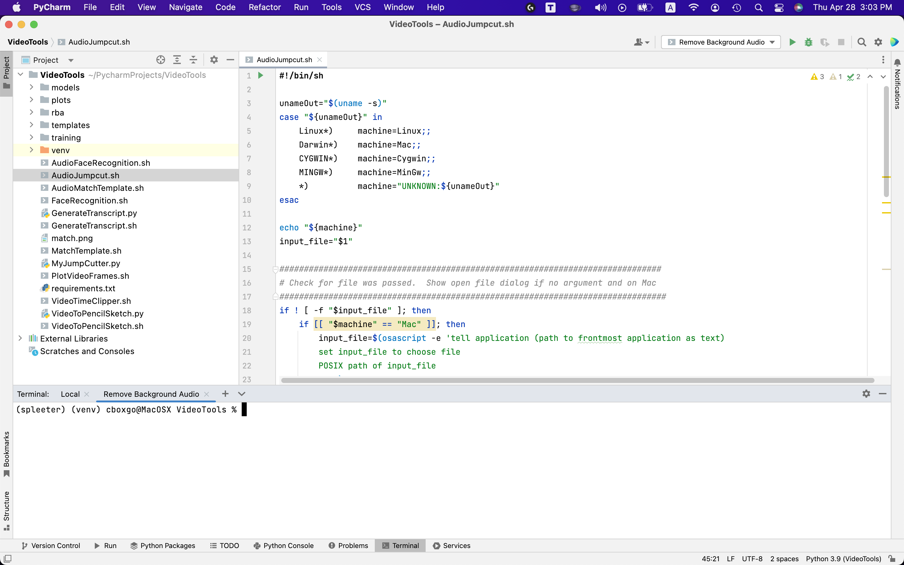
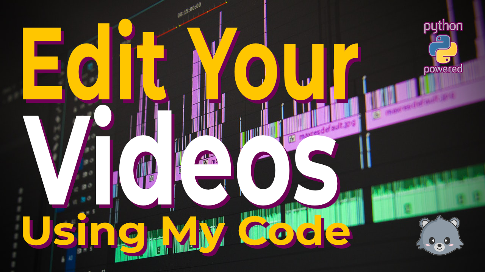

# Video Tools
Python code and shell scripts to help make video editing faster and easier...

Before using this code please read the project [Disclaimer](Disclaimer.md)



## Demo

[](https://www.youtube.com/watch?v=Ep2jBjvIZwI)

If you find these tools useful then consider watching my other content and subscribing to my channel.

## Features

  1. Audio + Face Recognition Jumpcut
  2. Audio Jumpcut
  3. Audio + Template Matching Jumpcut
  4. Batch Burn Subtitles From SRT
  5. Batch Change Video Resolution With Blur
  6. Batch Convert Video Format
  7. Batch Generate Speech From Text
  8. Batch Merge Image And Audio
  9. Batch Merge Video And Audio
 10. Batch Translate YouTube Playlist
 11. Batch Translate YouTube Playlist With TTS
 12. Batch Translate YouTube Video
 13. Batch Translate YouTube Video With TTS
 14. Burn Subtitles From SRT
 15. Change Video Aspect Ratio
 16. Change Video Resolution With Black Borders
 17. Change Video Resolution With Blur
 18. Change Volume Amount
 19. Compress Audio File
 20. Convert Video Format
 21. Create Animated GIF
 22. Create Mobile Crossclip
 23. Create Pencil Sketch Video
 24. Create Vintage Video
 25. Crop Video
 26. Cut Video Start To Duration
 27. Cut Video Start To End Time
 28. Download You Tube Video
 29. Extract Audio From Video
 30. Extract Images From Video
 31. Face Recognition Jumpcut
 32. Face Swap (untested)
 33. Fix YouTube Subtitles
 34. Flip Video Horizontally
 35. Flip Video Vertically
 36. Generate Game Highlights
 37. Generate Speech From Text
 38. Generate Video Subtitles
 39. Get YouTube Video List
 40. LBRY Download YouTube Playlist
 41. LBRY Migrate YouTube Playlist
 42. LBRY Upload Video Folder
 43. Match Template Jumpcut
 44. Merge Audio Files
 45. Merge Image And Audio
 46. Merge Multiple Videos
 47. Merge Video And Audio
 48. Mirror Video Horizontally
 49. Mirror Video Vertically
 50. Normalize Audio
 51. Plot Sound Frames
 52. Plot Video Frames
 53. Remove Audio From Video
 54. Remove Video Background
 55. Resize Video By Height
 56. Resize Video By Width
 57. Reverse Video
 58. Rotate Video Clockwise
 59. Rotate Video Counterclockwise
 60. TikTok Text To Speech (from txt file)
 61. Translate YouTube Description
 62. Translate YouTube Transcript
 63. Zoompan Cut Video
 
## Operating Systems

- MacOS
- Linus
- Windows 8+ with Cygwin or Bash for Windows
- Windows 10/11 with WSL (Windows Subsystem for Linux) 

To install WSL see the link below:
https://docs.microsoft.com/en-us/windows/wsl/install

List of terminal emulated:
https://www.jetbrains.com/help/pycharm/terminal-emulator.html#configure-the-terminal-emulator

However, PowerShell (powershell) & Command Prompt (cmd.exe) do not support the scripts I this project.

## Pre-requisites

1. Python 3+ - Python is an interpreted, object-oriented, high-level programming language with dynamic semantics.

2. Googletrans - a free and unlimited python library that implemented Google Translate API

3. Imutils - A series of convenience functions to make basic image processing functions such as translation, rotation, resizing, skeletonization, displaying Matplotlib images, sorting contours, detecting edges, and much easier with OpenCV and both Python 2.7 and Python 3.

4. Matplotlib - a comprehensive library for creating static, animated, and interactive visualizations in Python.

5. Numpy - the fundamental package for array computing with Python.

6. OpenCV - OpenCV (Open Source Computer Vision Library) is an open source computer vision and machine learning software library. 

7. playsound - a pure Python, cross-platform, single function module with no dependencies for playing sounds.

8. pydub - a library for manipulating audio with a simple and easy high level interface.

9. pyttsx3 - a text-to-speech conversion library in Python. Unlike alternative libraries, it works offline, and is compatible with both Python 2 and 3.

10. Requests - a simple, yet elegant, HTTP library.

11. SpeechRecognition - Library for performing speech recognition, with support for several engines and APIs, online and offline.

   To test for setup errors, simple type the following command and talk into your microphone to see if it translates your voice to text:

   ```spython -m speech_recognition```

12. YouTube Transcript/Subtitle API - a python API which allows you to get the transcript/subtitles for a given YouTube video. It also works for automatically generated subtitles, supports translating subtitles, and it does not require a headless browser, like other selenium based solutions do!

13. Spleeter

## Installation

1. Install Homebrew

    ```/bin/bash -c "$(curl -fsSL https://raw.githubusercontent.com/Homebrew/install/HEAD/install.sh)"```

2. Install Python

    ```brew install python```

3. PyCharm CE (Community Edition) - Free

    PyCharm can be downloaded here: https://www.jetbrains.com/pycharm/download

4. Setup Project in pyCharm

    When setting up the new project, be sure to create a new virtual environment with the Homebrew Python installation as the base interpreter, and check both "Inherit global site-packages, and "Make available to all projects."

5. Install Video-Tools by performing the following steps:

    A. Select the pyCharm project directory

    B. Issue the following command from the shell inside the project directory in Step A:

   ```git clone https://github.com/bearcatjamboree/Video-Tools.git```

    C. Type the following command to install pre-requisite python modules:

   ```pip install -r requirements.txt```
        
    D. To setup Spleeter on Non-M1 systems type the following command from the shell:
    
   ```pip install spleeter```

    On Mac M1 system follow these steps:

    https://github.com/jeffheaton/t81_558_deep_learning/blob/master/install/tensorflow-install-mac-metal-jul-2021.ipynb
    
    NOTE: the Run->Edit Configurations menu can now be used to create references to the shell scripts to make them easily accessible through the pyCharm client.
    
6. Cascade Trainer GUI (Version 3.3.1 or better):

    If you want to train your own Haar Cascade Classifiers then this GUI can help make training and testing much easier:
    https://drive.google.com/drive/folders/1kZDzGx_RKu3qH_QONSxksR7gfZReevMg

    Install the GUI with Wineskin if on Mac/Linux.  Wineskin can be downloaded and installed through HomeBrew using the following command:

    ```brew install --no-quarantine gcenx/wine/unofficial-wineskin```

## Known Issues

For M1 installations, to use the RemoveVocals.sh or RemoveBackgroundMusic.sh you must enter:

   ```conda activate spleeter```

Note, this is only if you called the separate environment "spleeter."

If you attempt to use PyTTSx3 (text-to-speech) while the spleeter environment is active then you may have issues translating text-to-speech with macOS NSS.  This was observed to be an issue with macOS on M1 though occurrences was somewhat random.

If you found these tools helpful then please consider subscribing to one of my YouTube channels:

English:
https://www.youtube.com/c/Bearcatjamboree?sub_confirmation=1

Spanish:
https://www.youtube.com/channel/UCnRVM0LLt-XgBeO3U-b1qbA?sub_confirmation=1

Chinese:
https://www.youtube.com/channel/UCnXDKHYWebD065Ed-FlvhwQ?sub_confirmation=1

Hindi:
https://www.youtube.com/channel/UCE1zO3HLk8DIc2zTsl7eH5Q?sub_confirmation=1

Arabic:
https://www.youtube.com/channel/UCkESzVVlDDB69-XJOWlDn8g?sub_confirmation=1

Indonesian:
https://www.youtube.com/channel/UCy5k3dtLtjn8FVmo8tNWeBQ?sub_confirmation=1
