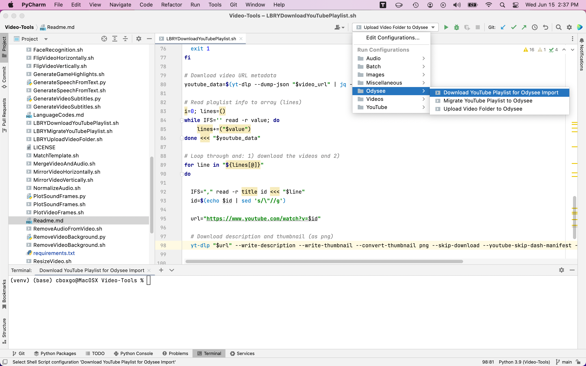

# Video Tools
Python code and shell scripts to help make video editing faster and easier



## Demo

[](https://www.youtube.com/watch?v=Ep2jBjvIZwI)

If you find these tools useful then consider watching my other content and subscribing to my channel.

## Features

 1. Remove background music (previously rba)
 2. Remove vocals (karaoke)
 3. Jump cut videos using volume level  
 4. Jump cut videos by matching a template photo
 5. Jump cut videos based on facial recognition
 6. Jump cut video using volume level and template matching
 7. Jump cut video using volume level and facial recognition
 8. Change video aspect ratio
 9. Change video volume level
 10. Compress audio file (using video or audio file)
 11. Convert video format
 12. Create animated GIFs
 13. Create pencil sketch video
 14. Create vintage-style video
 15. Crop video to desired size
 16. Cut video from start time by duration
 17. Cut video from start time to end time
 18. Extract audio from video
 19. Extract images from video (1-per second)
 20. Flip video horizontally
 21. Flip video vertically
 22. Generate speech from text (experimental)
 23. Generate video subtitles
 24. Get YouTube Transcript 
 25. Burn Subtitles From SRT
 26. Mirror video horizontally
 27. Mirror video vertically
 28. Plot video frames
 29. Remove audio from video (produces soundless video)
 30. Remove video background  (experimental)
 31. Resize video (aspect ratio retained)
 32. Rotate video clockwise
 33. Rotate video counterclockwise
 
## Operating Systems

- MacOS
- Linus
- Windows 8+ with Cygwin or Bash for Windows
- Windows 10/11 with WSL (Windows Subsystem for Linux) 

To install WSL see the link below:
https://docs.microsoft.com/en-us/windows/wsl/install

List of terminal emulated:
https://www.jetbrains.com/help/pycharm/terminal-emulator.html#configure-the-terminal-emulator

However, PowerShell (powershell) & Command Prompt (cmd.exe) do not support the scripts I this project.

## Pre-requisites

1. Python 3+ - Python is an interpreted, object-oriented, high-level programming language with dynamic semantics.

2. Imutils - A series of convenience functions to make basic image processing functions such as translation, rotation, resizing, skeletonization, displaying Matplotlib images, sorting contours, detecting edges, and much more easier with OpenCV and both Python 2.7 and Python 3.

3. Numpy - the fundamental package for array computing with Python.

4. OpenCV - OpenCV (Open Source Computer Vision Library) is an open source computer vision and machine learning software library.

5. SpeechRecognition - Library for performing speech recognition, with support for several engines and APIs, online and offline.

    To test for setup errors, simple type the following command and talk into your microphone to see if it translates your voice to text:

    ```python -m speech_recognition```

6. Spleeter

## Installation

1. Install Homebrew

    ```/bin/bash -c "$(curl -fsSL https://raw.githubusercontent.com/Homebrew/install/HEAD/install.sh)"```

2. Install Python

    ```brew install python```

3. PyCharm CE (Community Edition) - Free

    PyCharm can be downloaded here: https://www.jetbrains.com/pycharm/download

4. Setup Project in pyCharm

    When setting up the new project, be sure to create a new virtual environment with the Homebrew Python installation as the base interpreter, and check both "Inherit global site-packages, and "Make available to all projects."

5. Install Video-Tools by performing the following steps:

    A. Select the pyCharm project directory

    B. Issue the following command from the shell inside the project directory in Step A:

   ```git clone https://github.com/bearcatjamboree/Video-Tools.git```

    C. Type the following command to install pre-requisite python modules:

   ```pip install -r requirements.txt```
        
    D. To setup Spleeter on Non-M1 systems type the following command from the shell:
    
   ```pip install spleeter```

    On Mac M1 system follow these steps:

    https://github.com/jeffheaton/t81_558_deep_learning/blob/master/install/tensorflow-install-mac-metal-jul-2021.ipynb
    
    NOTE: the Run->Edit Configurations menu can now be used to create refereshes to the shell scripts to make them easily accessible through the pyCharm client.
    
6. Cascade Trainer GUI (Version 3.3.1 or better):

    If you want to train your own Haar Cascade Classifiers then this GUI can help make training and testing much easier:
    https://drive.google.com/drive/folders/1kZDzGx_RKu3qH_QONSxksR7gfZReevMg

    Install the GUI with Wineskin if on Mac/Linux.  Wineskin can be downloaded and installed through HomeBrew using the following command:

    ```brew install --no-quarantine gcenx/wine/unofficial-wineskin```

If you found these tools helpful then please consider checking out my other content and subscribing to my YouTube channel:
https://www.youtube.com/c/Bearcatjamboree?sub_confirmation=1
